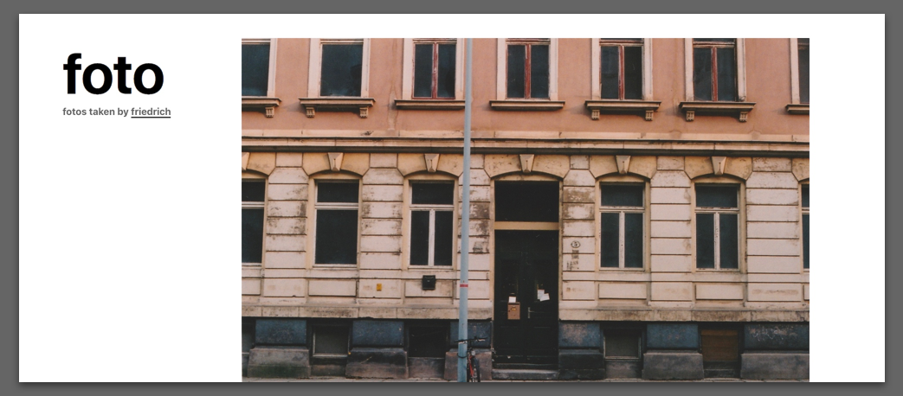

## <a href="https://foto.weise.io/">foto.weise.io</a> – selfhosted photographs
selfhosted replacement for my deleted instagram feed.


#### Dev Setup
```
npm install
# starts sass compiling and browsersync tasks
gulp
```
